<p align="center">
  
</p>

# ⚡ Claude Code 원클릭 설치

**[🇰🇷 한국어](README.md)** · [🇺🇸 English](README.en.md)

> 터미널을 한 번도 안 써봤어도 괜찮습니다. 설치는 이게 전부예요:
>
> ### ① 아래 명령어의 복사 버튼 클릭 → ② 터미널/PowerShell에 붙여넣기 → ③ Enter
>
> 나머지(설치, 설정, Node.js, 실행)는 전부 자동으로 진행됩니다.

[](#-macos에서-설치하기)
[](#-windows에서-설치하기)
[](#-막혔을-때--이렇게-하면-무조건-해결됩니다)

## ✅ 시작 전 딱 하나만 확인

Claude Code는 **Claude 유료 구독(Pro / Max / Team / Enterprise)** 계정이 필요합니다. 무료 계정으로는 로그인이 안 돼요. 구독이 없다면 [claude.ai](https://claude.ai)에서 먼저 가입해주세요.

---

## 🍎 macOS에서 설치하기

### 1단계 — 터미널 열기

1. 키보드에서 **⌘ Command + Space** 를 동시에 누르세요 (검색창이 뜹니다)
2. **터미널** 이라고 입력하고 **Enter**

> 검은(또는 흰) 글자 입력창이 뜨면 성공! 무서워 보여도 그냥 글자 입력하는 창일 뿐이에요.

### 2단계 — 아래 명령어 한 줄 복사해서 붙여넣기

아래 상자에 마우스를 올리면 **오른쪽 위에 복사 버튼(📋)** 이 나타납니다. 클릭 한 번이면 복사 끝.

```bash
curl -fsSL https://raw.githubusercontent.com/youngjungju/claude-code-one-click/main/install-mac.sh | bash
```

터미널 창을 클릭한 뒤 **⌘ Command + V** 로 붙여넣고 **Enter**.

### 3단계 — 끝!

화면에 `[1/6]`, `[2/6]`... 진행 상황이 한국어로 표시되고, 마지막에 **🎉 설치 성공!** 이 뜨면 3초 후 Claude가 자동 실행됩니다. 브라우저가 열리면 로그인하세요. 앞으로는 터미널에 `claude` 라고만 입력하면 됩니다.

---

## 🪟 Windows에서 설치하기

### 1단계 — PowerShell 열기

1. 키보드 왼쪽 아래 **⊞ Windows 키**를 누르세요
2. **powershell** 이라고 입력하고 **Enter**

> 파란(또는 검은) 글자 입력창이 뜨면 성공!

### 2단계 — 아래 명령어 한 줄 복사해서 붙여넣기

아래 상자 오른쪽 위의 **복사 버튼(📋)** 을 클릭하세요.

```powershell
irm https://raw.githubusercontent.com/youngjungju/claude-code-one-click/main/install-windows.ps1 | iex
```

PowerShell 창에서 **마우스 우클릭**으로 붙여넣고 **Enter**. (우클릭이 곧 붙여넣기예요)

### 3단계 — 끝!

`[1/7]`, `[2/7]`... 진행 후 **설치 성공!** 이 뜨면 3초 후 Claude가 자동 실행됩니다. 브라우저가 열리면 로그인하세요.

---

## 🆘 막혔을 때 — 이렇게 하면 무조건 해결됩니다

어디서 멈췄든, 에러가 뭐든 상관없습니다:

1. 터미널/PowerShell 화면 전체를 마우스로 드래그해서 복사하세요
   - Windows: 드래그하면 자동 복사되는 경우가 많아요 (안 되면 드래그 후 우클릭)
   - Mac: 드래그 후 **⌘C**
2. [claude.ai](https://claude.ai) 에 접속해서 새 채팅을 열고
3. 이렇게 붙여넣으세요:

```
Claude Code 설치하다 막혔어. 아래는 내 화면 전체야. 어떻게 해결해?
---
(여기에 복사한 화면 붙여넣기)
```

Claude가 당신의 상황에 맞는 해결책을 알려줍니다. **해결 후에는 창을 닫고 새로 연 다음** 설치 명령을 다시 실행하세요 — 처음부터 다시 안전하게 진행됩니다.

## ❓ 자주 겪는 문제

| 증상 | 해결 |
|---|---|
| `'claude'은(는) 인식되지 않습니다` | 터미널/PowerShell 창을 **완전히 닫고 새로 연 뒤** `claude` 다시 입력 |
| `App unavailable in region` | 한국에서 가끔 발생 — VPN으로 미국/일본 접속 후 다시 시도 |
| 로그인은 됐는데 `API Error 400 ... organization disabled` | 설치 스크립트가 자동으로 경고해주는 `ANTHROPIC_API_KEY` 문제 — 화면의 안내를 따르거나 위의 [막혔을 때](#-막혔을-때--이렇게-하면-무조건-해결됩니다) 방법 사용 |
| 무료 계정으로 로그인 안 됨 | 정상입니다 — Pro 이상 유료 구독 필요 |

## 🔍 이 스크립트가 하는 일 (투명성)

1. 이미 설치돼 있으면 재설치하지 않고 바로 실행 (손상된 설치는 자동 복구)
2. [Anthropic 공식 설치 프로그램](https://claude.ai/install.sh) 실행 — 이 저장소는 공식 설치를 감싸서 초보자용 자동화(PATH 설정, 흔한 함정 제거, 한국어 안내)를 더한 것뿐입니다
3. 터미널에서 `claude` 명령이 바로 되도록 설정
4. 로그인을 방해하는 설정 자동 감지
5. **Node.js**가 없으면 LTS 버전 함께 설치 (Mac: nvm — 관리자 비밀번호 불필요 / Windows: winget) — 실패해도 Claude Code 설치는 계속됩니다
6. 설치 검증 후 Claude 실행

모든 코드는 이 저장소에서 직접 확인할 수 있습니다.
